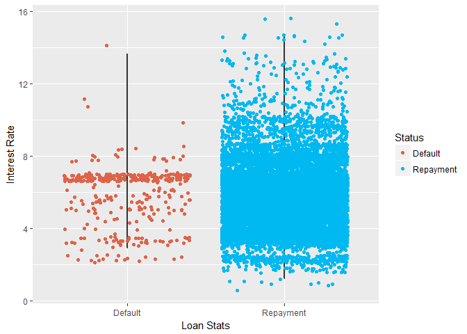

------------------------------------------------------------------------

Introduction
============

Student loan debt is a $1.3T problem facing over 44 million Americans. The average 2016 graduate left college with over $37,000 of debt and is burdened with over $350 a month in student loan payments. Student Loan Hero was conceived as a resource to help student loan borrowers understand the various student loan repayment schemes, navigate the numerous federal programs designed to help borrowers with their loans, and recommend ways for borrowers to save money on their loans. Student Loan Hero developed a proprietary tool that aggregates all of a borrower's loans and displays the details all in one place, then generates a customized repayment plan based on each borrower's unique circumstances. To date, the tool has analyzed over $2 billion worth of student loan debt and helped 50,000 plus borrowers best pay off their student loans. This course offered the perfect opportunity to explore the vast amount of borrower data gathered in the three years Student Loan Hero has been operating.

The Goal
--------

Student loan delinuency and default rates are on the rise, the past four straight quarters have witnessed student loan repayment delinquencies increasing with little public consensus as to why. Student loan debt as a whole affects the economy in a number of ways. 41% of student loan borrowers have reported they've delayed homeownership as a result of excessive student loan debt, contributing to a housing market slowdown. Would-be entrepreneurs are also admitting that student loans are holding them back from starting new businesses. When borrowers do default on their student loans they face a myriad of consequences. Defaulting borrowers lose all potential federal student loan protections including access to programs such as forbearance, deferment, and any forgiveness programs. Defaulters will also see their credit scores negatively impacted which could negatively impact a borrower's eligbility for any new loans. Defaulters may also see their paychecks garneshed by the government, have collection fees and added interest tacked on to their existing balances, and could have legal actions taken against them.


By using a binary classification machine learning algorithm we hope to be able to predict whether a given borrower is likely to default on their student loans. The business application of being able to accurately make this prediction is if a borrower is likely to default on their student loans, Student Loan Hero has the opportunity to connect with high-risk borrowers and help those borrowers take appropriate action to avoid default.

Datasets
========

Student Loan Hero User Dataset
------------------------------

The private Student Loan Hero User dataset contains data from 24,000 anonymized student loans along with various details of the user's university data such as the user's major, college attended, along with post-graduation data such as current salary, current profession, and credit score. It also contains specific loan details such as interest rate, disbursement date, and original principal.

``` r
names(slhloans)
```

    ##  [1] "User.ID.."                    "User.DOB"                    
    ##  [3] "Loan.ID.."                    "Original.Principal"          
    ##  [5] "Current.Principal"            "Rate"                        
    ##  [7] "Loan.Disbursement.Date"       "Monthly.Interest"            
    ##  [9] "Monthly.Payment"              "Name"                        
    ## [11] "Status"                       "Type"                        
    ## [13] "Education.Degree"             "College"                     
    ## [15] "Major"                        "Employment.Status"           
    ## [17] "Adjusted.Gross.Income"        "Joint.Federal.Income.Tax."   
    ## [19] "Spouse.Adjusted.Gross.Income" "Employer.Type"               
    ## [21] "Profession"                   "Family.Size"                 
    ## [23] "State.of.Residency"           "Credit.Score"

Carnegie Mellon University Classifications
------------------------------------------

The Carnegie Mellon University Classification dataset is a framework for categorizing and classifying United States institutes of higher education. All Title IV colleges and universities are listed along with accompanying classifying data including attributes such as enrollment profiles (demographics, student statuses, etc), university size and setting, any unique university characteristics such as whether the school is a technical or vocational school, historically black colleges and universities, women's only universities, etc. This dataset was desired for categorizing the hundreds of universities Student Loan Hero Users have attended into smaller buckets of for the binary classification machine learning algorithm used to predict whether a user will default on their student loans.

``` r
univ <- read.csv("collegedetails.csv")
names(univ)
```

    ##  [1] "NAME"           "CITY"           "STABBR"         "CONTROL"       
    ##  [5] "OBEREG"         "LOCALE"         "LANDGRNT"       "ENRPROFILE2015"
    ##  [9] "MEDICAL"        "HBCU"           "TRIBAL"         "HSI"           
    ## [13] "MSI"            "WOMENS"         "COPLAC"         "CUSU"          
    ## [17] "CUMU"

Preparing and Cleaning Datasets
===============================

Since the goal of this project is to predict the likelihood a borrower will default on their loans by the use of a binary classification machine learning model it was imperative to narrow the number of levels in a number of factors in the Student Loan Hero dataset.

Status
------

The most important factor to isolate and address is the loan "status", this factor contains all statuses a borrower's loan could be in, for Student Loan Hero users. This will be our target factor for our binary classification machine learning algorithm..

``` r
str(slhloans$Status)
```

    ##  Factor w/ 149 levels "ADMIN DELINQ PRIOR TO IDR",..: 101 101 101 101 101 76 104 104 87 87 ...

``` r
head(levels(factor(slhloans$Status)))
```

    ## [1] "ADMIN DELINQ PRIOR TO IDR"                 
    ## [2] "ADMIN FORBEARANCE"                         
    ## [3] "ADMIN PRE-HARDSHIP FORB"                   
    ## [4] "ADMINISTRATIVE FORBEARANCE"                
    ## [5] "ADMINISTRATIVE FORBEARANCE-ENDS 03/08/2016"
    ## [6] "ADMINISTRATIVE FORBEARANCE-ENDS 11/15/2016"

This factor with 149 levels needed to be reduced to just two levels for the purposes of the desired machine learning algorithm. A borrower's loan should fall into one of two statuses, either in "Repayment" or in "Default". This meant first breaking down the statuses by frequency, identifying duplicate but misnamed levels, and merging levels that had similar meanings.

``` r
levels(factor(slhloans$Status))
```

    ## [1] "Default" "RPM"

Major
-----

Cleaning the major'obtained by borrowers was necessay to undertake since the non-standardized factor had over 1,300 different entries, the majority of which were duplicative in nature (for example, one borrower's degree read "International Studies" while another's read "Int'l Studies").

``` r
str(slhloans$Major)
```

    ##  Factor w/ 1340 levels " health science",..: 777 777 777 777 777 777 1130 1130 483 483 ...

Condensing the majors to the most frequently occuring and a basket titled "others" for any other majors made this factor much easier to work with.

``` r
levels(slhloans$Major) <- gsub(".*Law.*|.*Lawyer.*|.*attorney.*|.*JD.*|.*Juris Doctor.*|.*Paralegal.*", 
    "Law", levels(slhloans$Major))
levels(slhloans$Major) <- gsub(".*Business.*|.*Financ.*|.*Account.*|.*Economic.*|.*Marketing.*|.*Human Resources.*", 
    "Business", levels(slhloans$Major))
levels(slhloans$Major) <- gsub(".*Philosophy.*|.*Social.*|.*Politic.*|.*English.*|.*History.*|.*Sociology.*|.*International.*|.*General Studies.*|.*Fashion.*", 
    "Liberal Arts", levels(slhloans$Major))
levels(slhloans$Major) <- gsub(".*Engineer.*", "Engineering", 
    levels(slhloans$Major))
levels(slhloans$Major) <- gsub(".*Medicine.*|.*MD.*|.*Physician*|.*Doctor.*|.*Pharmacy.*|.*Medical.*|.*medicine.*", 
    "Higher Medical Degree", levels(slhloans$Major))
levels(slhloans$Major) <- gsub(".*Teach.*|.*Education.*|.*Teach.*", 
    "Education", levels(slhloans$Major))
levels(slhloans$Major) <- gsub(".*Technology.*|.*Computer.*|.*Systems.*", 
    "Computer Science", levels(slhloans$Major))
levels(slhloans$Major) <- gsub(".*Communication.*|.*Relations.*", 
    "Communications", levels(slhloans$Major))
levels(slhloans$Major) <- gsub(".*Science.*|.*Biology.*|.*Chemistry.*|.*Geology.*|.*Bioengineer.*|.*Physics.*|.*Mathematics.*", 
    "Sciences", levels(slhloans$Major))
levels(slhloans$Major) <- gsub(".*Psychology.*", "Psychology", 
    levels(slhloans$Major))
levels(slhloans$Major) <- gsub("Art|.*Graphic.*|.*Film.*|.*Drama.*|.*Music.*|.*Photography.*", 
    "Arts", levels(slhloans$Major))
levels(slhloans$Major) <- gsub(".*Nurs.*|.*nurs.*", "Nursing", 
    levels(slhloans$Major))

OtherMajors <- !(slhloans$Major %in% c("Business", "Sciences", 
    "Higher Medical Degree", "Engineering", "Liberal Arts", "Law", 
    "Education", "Nursing", "Psychology", "Communications", "MBA"))

slhloans$Major[OtherMajors] <- "Other"

slhloans$Major <- factor(slhloans$Major)

levels(slhloans$Major)
```

    ##  [1] "Law"                   "Business"             
    ##  [3] "Engineering"           "Sciences"             
    ##  [5] "Education"             "Psychology"           
    ##  [7] "Communications"        "Higher Medical Degree"
    ##  [9] "Nursing"               "MBA"                  
    ## [11] "Other"

Profession
----------

Cleaning the profession's of borrowers again was important since to start borrowers had self-identified into over 1800 different professions.

``` r
str(slhloans$Profession)
```

    ##  Factor w/ 1854 levels ""," ","    ",..: 414 414 414 414 414 414 1 1 349 349 ...

By first merging duplicative or identical professions (example: accountant, certified public accountant) and then analyzing the most frequently occuring professions the profession level was narrowed to ten of the most occurring professions and a catchall category of "Other" for all other professions.

``` r
levels(slhloans$Profession) <- gsub(".*Lawyer.*|.*attorney.*", "Attorney", levels(slhloans$Profession))
levels(slhloans$Profession) <- gsub(".*Engineer.*", "Engineer", levels(slhloans$Profession))
levels(slhloans$Profession) <- gsub(".*Teacher.*", "Teacher", levels(slhloans$Profession))
levels(slhloans$Profession) <- gsub(".*Nurse.*", "Doctor/Nurse/Pharmacist", levels(slhloans$Profession))
levels(slhloans$Profession) <- gsub(".*Doctor.*", "Doctor/Nurse/Pharmacist", levels(slhloans$Profession))
levels(slhloans$Profession) <- gsub(".*Therapist.*", "Doctor/Nurse/Pharmacist", levels(slhloans$Profession))
levels(slhloans$Profession) <- gsub(".*Physician.*", "Doctor/Nurse/Pharmacist", levels(slhloans$Profession))
levels(slhloans$Profession) <- gsub(".*Dentist.*", "Doctor/Nurse/Pharmacist", levels(slhloans$Profession))
levels(slhloans$Profession) <- gsub(".*Dental.*", "Doctor/Nurse/Pharmacist", levels(slhloans$Profession))
levels(slhloans$Profession) <- gsub(".*Physician's.*", "Doctor/Nurse/Pharmacist", levels(slhloans$Profession))
levels(slhloans$Profession) <- gsub(".*Psychologist.*", "Doctor/Nurse/Pharmacist", levels(slhloans$Profession))
levels(slhloans$Profession) <- gsub(".*Psychiatrist.*", "Doctor/Nurse/Pharmacist", levels(slhloans$Profession))
levels(slhloans$Profession) <- gsub(".*Medical.*", "Doctor/Nurse/Pharmacist", levels(slhloans$Profession))
levels(slhloans$Profession) <- gsub(".*Chiropractor.*", "Doctor/Nurse/Pharmacist", levels(slhloans$Profession))
levels(slhloans$Profession) <- gsub(".*Pharmacist.*", "Doctor/Nurse/Pharmacist", levels(slhloans$Profession))
levels(slhloans$Profession) <- gsub(".*Nursing.*", "Doctor/Nurse/Pharmacist", levels(slhloans$Profession))
levels(slhloans$Profession) <- gsub(".*Computer.*", "Computer/Tech", levels(slhloans$Profession))
levels(slhloans$Profession) <- gsub(".*Developer.*", "Computer/Tech", levels(slhloans$Profession))
levels(slhloans$Profession) <- gsub(".*IT.*", "Computer/Tech", levels(slhloans$Profession))
levels(slhloans$Profession) <- gsub(".*Teacher.*", "Teacher", levels(slhloans$Profession))
levels(slhloans$Profession) <- gsub(".*Librarian.*", "Teacher", levels(slhloans$Profession))
levels(slhloans$Profession) <- gsub(".*Professor.*", "Teacher", levels(slhloans$Profession))
levels(slhloans$Profession) <- gsub(".*Accounting.*", "Accountant", levels(slhloans$Profession))
levels(slhloans$Profession) <- gsub(".*Student.*|.*Resident.*|.*Researcher.*|.*student.*", "Student", levels(slhloans$Profession))
levels(slhloans$Profession) <- gsub(".*Designer.*|.*Graphic.*", "Designer", levels(slhloans$Profession))
levels(slhloans$Profession) <- gsub(".*Business.*|.*Manager.*|.*Marketing.*|.*Financial.*|.*Analyst.*|.*Insurance.*|.*Consultant*.|.*Resources.*|.*Consulting.*", "General Business", levels(slhloans$Profession))
levels(slhloans$Profession) <- gsub(".*Retail.*|.*Cashier.*", "Retail", levels(slhloans$Profession))

OtherProfessions <- !(slhloans$Profession %in% c("Doctor/Nurse/Pharmacist","General Business", "Engineer", "Attorney", "Teacher", "Computer/Tech", "Accountant", "Student", "Designer", "Retail"))

slhloans$Profession[OtherProfessions]<- "Other"

slhloans$Profession <- factor(slhloans$Profession)
```

``` r
levels(factor(slhloans$Profession))
```

    ##  [1] "General Business"        "Teacher"                
    ##  [3] "Doctor/Nurse/Pharmacist" "Accountant"             
    ##  [5] "Attorney"                "Engineer"               
    ##  [7] "Computer/Tech"           "Designer"               
    ##  [9] "Student"                 "Retail"                 
    ## [11] "Other"

Other Factors
-------------

By using domain knowledge of the US student loan industry,the "Servicer" factor was removed as it should have no bearing on whether a borrower will default or not.

Exploratory Data Analysis
=========================

In examning the new cleaned data set, we can see we have a fairly unbalanced data set with the majority of borrowers in "repayment" and only a handful in "default".

``` r
slhloans%>%group_by(Status)%>% dplyr::summarise(Count=n())
```

    ## # A tibble: 2 x 2
    ##    Status Count
    ##     <chr> <int>
    ## 1 Default   520
    ## 2     RPM 35553

Loans in repayment and default by degree type
---------------------------------------------

Before we can take a look at a cohort analysis of loan status by degree types a few steps had to be taken first.

In order to better understand where users are in their journey of paying off their student loan debt, a column calculating the difference between the original loan's balance and the current loan's balance was added.

``` r
#adding a new calculated column = difference between original and current principal

slhloans <- mutate(slhloans, Difference=Current.Principal-Original.Principal)

summary(slhloans$Difference)
```

    ##    Min. 1st Qu.  Median    Mean 3rd Qu.    Max. 
    ## -250669     -93     115    1872    1851  192648

To ensure we're only analyzing loans with a positive balance present, I used the reviously calculated "difference" column to filter out any zero-balance loans.

``` r
#Using only records where difference is positive, and rate is >0
slhloans <- filter(slhloans, Difference>=0&Rate>0)
```

    ## Warning: package 'bindrcpp' was built under R version 3.4.3

To ensure only loans where there was an initial balance added by the user, any loans with an original balance of 0 were removed.

``` r
#getting rid of records where original principal is 0
slhloans <- filter(slhloans, Original.Principal>0)
```

Now that we have filtered out null and errantly-balanced loans, we can take a look at the distribution of degrees, and the status of student loans by those different degrees.

``` r
ggplot(slhloans, aes(Education.Degree, fill=Status))+theme_fivethirtyeight()+geom_bar()+theme(legend.position = "right", legend.direction = "vertical",axis.text.x = element_text(angle = 90, hjust = 1)) + scale_fill_manual(values=c("#DE6449", "#00b9f1"))
```


Loan disbursement distribution by year
--------------------------------------

Since the database where the loans was held had a non-standardized date field, it was necessary to standardize the date using lubridate. Once luubriated, the dates were converted to a format where calculations could be performed on them.

``` r
#Lubridating the date field from character to true date field
slhloans$Loan.Disbursement.Date <- mdy(slhloans$Loan.Disbursement.Date)
```

Taking a look at the distribution of years when the users' loans were disbursed

``` r
yearwise_desc <- arrange(yearwise, desc(Count))

colnames(yearwise) <- c("year", "count")

ggplot(yearwise, (aes(x = year, y = count, fill = count))) + geom_bar(stat="identity") + scale_fill_gradient(low = "yellow", high = "red")
```

    ## Warning: Removed 1 rows containing missing values (position_stack).


Student Loan Hero users by state
--------------------------------

Blending Carnegie Mellon University Classifications Dataset with Student Loan Hero Users Dataset
------------------------------------------------------------------------------------------------

To better bucket the colleges and universities Student Loan Hero users attended for our classification algorithm 11 attributes from the Carnegie Mellon University Calssification dataset were added to the Student Loan Hero users dataset.

``` r
univ <- read.csv("collegedetails.csv")
summary(univ)
```

    ##                                               NAME     
    ##  ITT Technical Institute-Madison-Madison        :   3  
    ##  ITT Technical Institute-Springfield-Springfield:   3  
    ##  Anderson University-Anderson                   :   2  
    ##  Columbia College-Columbia                      :   2  
    ##  Glendale Community College-Glendale            :   2  
    ##  Interactive College of Technology-Houston      :   2  
    ##  (Other)                                        :4651  
    ##            CITY          STABBR        CONTROL          OBEREG     
    ##  New York    :  60   CA     : 451   Min.   :1.000   Min.   :0.000  
    ##  Chicago     :  59   NY     : 305   1st Qu.:1.000   1st Qu.:3.000  
    ##  Los Angeles :  35   TX     : 259   Median :2.000   Median :5.000  
    ##  Brooklyn    :  34   PA     : 257   Mean   :1.924   Mean   :4.592  
    ##  Houston     :  34   FL     : 225   3rd Qu.:3.000   3rd Qu.:6.000  
    ##  Philadelphia:  32   OH     : 211   Max.   :3.000   Max.   :9.000  
    ##  (Other)     :4411   (Other):2957                                  
    ##      LOCALE         LANDGRNT       ENRPROFILE2015     MEDICAL       
    ##  Min.   :-3.00   Min.   :0.00000   Min.   :1.000   Min.   :0.00000  
    ##  1st Qu.:12.00   1st Qu.:0.00000   1st Qu.:1.000   1st Qu.:0.00000  
    ##  Median :21.00   Median :0.00000   Median :2.000   Median :0.00000  
    ##  Mean   :20.06   Mean   :0.02337   Mean   :2.758   Mean   :0.03923  
    ##  3rd Qu.:23.00   3rd Qu.:0.00000   3rd Qu.:4.000   3rd Qu.:0.00000  
    ##  Max.   :43.00   Max.   :1.00000   Max.   :7.000   Max.   :1.00000  
    ##                                                                     
    ##       HBCU             TRIBAL              HSI              MSI        
    ##  Min.   :0.00000   Min.   :0.000000   Min.   :0.0000   Min.   :0.0000  
    ##  1st Qu.:0.00000   1st Qu.:0.000000   1st Qu.:0.0000   1st Qu.:0.0000  
    ##  Median :0.00000   Median :0.000000   Median :0.0000   Median :0.0000  
    ##  Mean   :0.02165   Mean   :0.007503   Mean   :0.1132   Mean   :0.1854  
    ##  3rd Qu.:0.00000   3rd Qu.:0.000000   3rd Qu.:0.0000   3rd Qu.:0.0000  
    ##  Max.   :1.00000   Max.   :1.000000   Max.   :1.0000   Max.   :1.0000  
    ##                                                                        
    ##      WOMENS             COPLAC              CUSU         
    ##  Min.   :0.000000   Min.   :0.000000   Min.   :0.000000  
    ##  1st Qu.:0.000000   1st Qu.:0.000000   1st Qu.:0.000000  
    ##  Median :0.000000   Median :0.000000   Median :0.000000  
    ##  Mean   :0.008789   Mean   :0.006002   Mean   :0.007288  
    ##  3rd Qu.:0.000000   3rd Qu.:0.000000   3rd Qu.:0.000000  
    ##  Max.   :1.000000   Max.   :1.000000   Max.   :1.000000  
    ##                                                          
    ##       CUMU        
    ##  Min.   :0.00000  
    ##  1st Qu.:0.00000  
    ##  Median :0.00000  
    ##  Mean   :0.01822  
    ##  3rd Qu.:0.00000  
    ##  Max.   :1.00000  
    ## 

Once the Carnegie Mellon University Classification dataset was imported, the classifiers that were to be used for further analysis and matched up with the universities of SLH users were imported, including data such as the location (state and region) of university, type of university (is this a medical school, liberal arts school, womens school, etc).

``` r
cleanloans <- read.csv("slhloansclean.csv")
cleanloans$univctrl <- univ[match(cleanloans$College, univ$NAME),4]
cleanloans$univstate <- univ[match(cleanloans$College, univ$NAME),3]
cleanloans$univobereg <- univ[match(cleanloans$College, univ$NAME),5]
cleanloans$univlocale <- univ[match(cleanloans$College, univ$NAME),6]
cleanloans$univenrprofile <- univ[match(cleanloans$College, univ$NAME),8]
cleanloans$univmedical <- univ[match(cleanloans$College, univ$NAME),9]
cleanloans$univhbcu <- univ[match(cleanloans$College, univ$NAME),10]
cleanloans$univtribal <- univ[match(cleanloans$College, univ$NAME),11]
cleanloans$univhsi <- univ[match(cleanloans$College, univ$NAME),12]
cleanloans$univwomens <- univ[match(cleanloans$College, univ$NAME),14]
cleanloans$univlibarts <- univ[match(cleanloans$College, univ$NAME),15]
```

univctrl = University Control (Private not-for-profit University, Private for-profit University, Public University)
univstate = State University is located
univobereg = Region Code (New England, Mid-East, Great Lakes, Plains, Southeast, Southwest, Rocky Mountains, Far West, Outlying Areas)
univlocale = Degree of urbanization (How large is the town or city the university is located in)
univenrprofile = Profile of the university's enrollment (Exclusively undergraduate two-year, Exclusively undergraduate four-year, Very high undergraduate, High undergraduate, Majority undergraduate, Majority graduate, Exclusively graduate)
univmedical = Yes/No - Does the institution grant a medical degree (MD, DDS, DMD, DO, DVM)
univhbcu = Yes/No - is the university a historically black college or university
univtribal = Yes/No - is the university a tribal college
univhsi = Yes/No - is the university a hispanic serving insitute
univwomens = Yes/No - is the university a women's only institute
univlibarts = Yes/No - is the university a Council of Public Liberal Arts Colleges Member

Further Data Manipulation
-------------------------

Once the Carnegie Mellon University Classification dataset's key columns were added to our existing Student Loan Hero dataset it was necessary to re-format and add new columns to match the data imported. For example, the bucketed geographic data imported from the Carnegue Mellon University dataset was segmented by "region" and not "state" as the Student Loan Hero dataset had been segmented.

``` r
#change borrower home state to obereg to match the university state obereg

levels(cleanloans$State.of.Residency) <- gsub("VT|CT|ME|MA|NH|RI", "1", levels(cleanloans$State.of.Residency))
levels(cleanloans$State.of.Residency) <- gsub("DE|DC|MD|NJ|NY|PA", "2", levels(cleanloans$State.of.Residency))
levels(cleanloans$State.of.Residency) <- gsub("IL|IN|MI|OH|WI", "3", levels(cleanloans$State.of.Residency))
levels(cleanloans$State.of.Residency) <- gsub("IA|KS|MN|MO|NE|ND|SD", "4", levels(cleanloans$State.of.Residency))
levels(cleanloans$State.of.Residency) <- gsub("AL|AR|FL|GA|KY|LA|MS|NC|SC|TN|VA|WV", "5", levels(cleanloans$State.of.Residency))
levels(cleanloans$State.of.Residency) <- gsub("AZ|NM|OK|TX", "6", levels(cleanloans$State.of.Residency))
levels(cleanloans$State.of.Residency) <- gsub("CO|ID|MT|UT|WY", "7", levels(cleanloans$State.of.Residency))
levels(cleanloans$State.of.Residency) <- gsub("AK|CA|HI|NV|OR|WA", "8", levels(cleanloans$State.of.Residency))
levels(cleanloans$State.of.Residency) <- gsub("AS|FM|GU|MH|MP|PR|PW|VI", "9", levels(cleanloans$State.of.Residency))
```

Student loans in the United States of America can fall into two categories, private or federal. Private student loans are originated from banks and lending institutions not associated with any student assistance offered by the US government. Federal student loans are typically part of a student's financial aid package when attending a college and are primarily needs-based. The Student Loan Hero database had the full names of each student loan, but for the purposes of our desired binary classification machine learning algorithm to predict whether a user is likely to default we needed the category to be narrowed down to the broadest category of loan they would fall in - private or federal.

``` r
#Cleaning up Loan Names to just 2 type: Federal Loans or Private Loans
head(levels(cleanloans$Name))
```

    ## [1] "  \tCitiAssist® Undergraduate Loan"          
    ## [2] " PRIVATE STUDENT LOAN CC0001"                
    ## [3] " Sallie Mae Smart Option Student Loan #0709" 
    ## [4] " Sallie Mae Smart Option Student Loan #2441" 
    ## [5] " Sallie Mae Smart Option Student Loan #7004" 
    ## [6] " Sallie Mae Smart Option Student Loan #8245 "

``` r
levels(cleanloans$Name) <- gsub(".*Private.*", "Private", levels(cleanloans$Name))
levels(cleanloans$Name) <- gsub(".*Fargo.*", "Private", levels(cleanloans$Name))
levels(cleanloans$Name) <- gsub(".*Sallie.*", "Private", levels(cleanloans$Name))
levels(cleanloans$Name) <- gsub(".*Stafford.*|.*STAFFORD.*|.*stafford.*", "Federal", levels(cleanloans$Name))
levels(cleanloans$Name) <- gsub(".*Direct.*|.*direct.*|.*DIRECT.*", "Federal", levels(cleanloans$Name))
levels(cleanloans$Name) <- gsub(".*Federal.*|.*federal.*|.*FEDERAL.*", "Federal", levels(cleanloans$Name))
levels(cleanloans$Name) <- gsub(".*Signature.*|.*signature.*|.*SIGNATURE.*", "Federal", levels(cleanloans$Name))
levels(cleanloans$Name) <- gsub(".*subsidized.*|.*Subsidized.*|.*SUBSIDIZED.*", "Federal", levels(cleanloans$Name))
levels(cleanloans$Name) <- gsub(".*PLUS.*|.*plus.*|.*Plus.*", "Federal", levels(cleanloans$Name))
levels(cleanloans$Name) <- gsub(".*FFEL.*|.*ffel.*|.*Ffel.*", "Federal", levels(cleanloans$Name))
levels(cleanloans$Name) <- gsub(".*CONSOLIDATION.*|.*consolidation.*|.*Consolidation.*", "Federal", levels(cleanloans$Name))

OtherLoans <- !(cleanloans$Name %in% c("Private","Federal"))

cleanloans$Name[OtherLoans]<- "Private"

cleanloans$Name <- factor(cleanloans$Name)

levels(factor(cleanloans$Name))
```

    ## [1] "Private" "Federal"

``` r
sort(table(cleanloans$Name))
```

    ## 
    ## Private Federal 
    ##    1548   16959

From here we can see that federal loans outnumber private loans by more than 10x in the Student Loan Hero user dataset.

Geographic Analysis
-------------------

Now that we've blended data from the Carnegie Mellon University Classification dataset with the Student Loan Hero users dataset I wanted to take a look at how Student Loan Hero users differed by their state of residency.

    ## Warning: All formats failed to parse. No formats found.

``` r
#Loans per state
state_loans <- cleanloans%>%group_by(abb=univstate)%>%dplyr::summarize(value=n())
state_loans <- state_loans[complete.cases(state_loans),]
state_loans <- left_join(state_loans, state.regions, by='abb')
state_choropleth(state_loans, title="Loans Per State")
```


A quick look at where Student Loan Hero Users' loans originated from.

``` r
#Defaulted Loans as per status
status <- 'Default'
state_loans <- cleanloans%>%filter(Status==status)%>%group_by(abb=univstate)%>%dplyr::summarize(value=n())
state_loans <- state_loans[complete.cases(state_loans),]
state_loans <- left_join(state_loans, state.regions, by='abb')
state_choropleth(state_loans,title=paste0("Loans As Per Status:",status))
```


A look at where Student Loan Hero user's defaulted loans originated from. Note there are a number of states that have no defaulted loans from Student Loan Hero users.

``` r
#Loans as per rate of interest
state_loans <- cleanloans%>%group_by(abb=univstate)%>%dplyr::summarize(value=mean(Rate))
state_loans <- state_loans[complete.cases(state_loans),]
state_loans <- left_join(state_loans, state.regions, by='abb')
state_choropleth(state_loans,title="Average Rate of Interest")
```


A look at the average rate of interest on Student Loan Hero User's student loans by state. It's interesting to note that there are a number of states that appear to have high interest rates relative to other states, but as displayed in the previous chloropleth map they in fact have no defaulted loans from Student Loan Hero users. This goes contrary to the belief and line of thinking that higher student loan interest rates contribute to higher default rates among graduates.

Interest Rate Analysis
----------------------

### Average Interest rate of student loans by rate type (fixed vs variable)

``` r
#AVG INTEREST RATES by Fixed vs Variable Interest Rates
#Type <- 'Fixed'
loan_rates <- cleanloans%>%group_by(Type)%>%dplyr::summarize(value=mean(Rate))

ggplot(loan_rates, (aes(x = Type, y = value, fill=Type))) + geom_bar(stat="identity") + scale_fill_manual(values=c("#55967e", "#6d819c")) +  geom_text(aes(x=Type, y=value +0.3, label=paste(format(value, digits=3),"%"))) + scale_x_discrete(breaks=NULL, labels=waiver()) #scale_y_continuous(labels = scales::percent_format())
```


This is an interesting look at the average interest rates of a Student Loan Hero user's loan, broken out by variable and fixed interest rates. Typically, variable interest rates start off lower than fixed interest rates at time of origination and are adjusted as LIBOR is updated. Since the financial crisis of 2007-2008 rates have been kept artifically low, though as of late have been on the rise.

### Average interest rate of student loans by status (default vs repayment)

``` r
#AVG INTEREST RATES by Status
loan_rates_status <- cleanloans%>%group_by(Status)%>%dplyr::summarize(value=mean(Rate))
 
ggplot(loan_rates_status, (aes(x = Status, y = value, fill = Status))) + geom_bar(stat="identity") + theme_fivethirtyeight() + scale_fill_manual(values=c("#DE6449", "#00b9f1")) + geom_text(aes(x=Status, y=value +0.3, label=paste(format(value, digits=3),"%"))) + scale_x_discrete(breaks = NULL)
```


Again, in further examining the role interest rates may or may not play in contributing to student loan default rates here's how the breakdown of those interest rates of those in default and those in repayment stack up.

``` r
interestratebox <- ggplot(cleanloans, aes(cleanloans$Rate, cleanloans$Status))

interestratebox + geom_boxplot() + geom_jitter(width = 0.2,aes(col=Status)) + scale_color_manual(values=c("#DE6449", "#00b9f1")) + coord_flip()  +  xlab("Interest Rate") + ylab("Loan Stats")
```

    ## Warning: position_dodge requires non-overlapping x intervals



### Average interest rate of student loans by loan type (federal vs private)

``` r
#AVG INTEREST RATES by Loan Type (Federal or Private)
loan_rates_name <- cleanloans%>%group_by(Name)%>%dplyr::summarize(value=mean(Rate))

ggplot(loan_rates_name, (aes(x = Name, y = value, fill = Name))) + geom_bar(stat="identity") + scale_fill_manual(values=c("#c46b13", "#3f99b5")) + geom_text(aes(x=Name, y=value +0.3, label=paste(format(value, digits=3),"%"))) + scale_x_discrete(breaks = NULL) +ylab("Interest Rate") +xlab("Loan Type")
```


### Average balance of a users' student loans by loan type (federal vs private)

``` r
#AVG BALANCE by Loan Type (Federal or Private)
loan_balance_name <- cleanloans%>%group_by(Name)%>%dplyr::summarize(value=mean(Original.Principal))

ggplot(loan_balance_name, (aes(x = Name, y = value, fill= Name))) + geom_bar(stat="identity") + scale_fill_manual(values=c("#c46b13", "#3f99b5")) + geom_text(aes(x=Name, y=value, label=paste(format(value, digits=4))),vjust=-.3) + scale_x_discrete(breaks = NULL) + ylab("Loan Balance") +xlab("Loan Type")
```


### Average balance of a users' student loans by rate type (fixed vs variable)

``` r
#AVG BALANCE by Rate Type (Fixed vs Variable)
loan_balance_type <- cleanloans%>%group_by(Type)%>%dplyr::summarize(value=mean(Original.Principal))

ggplot(loan_balance_type, (aes(x = Type, y = value, fill= Type))) + geom_bar(stat="identity") + theme_fivethirtyeight() + scale_fill_manual(values=c("#55967e", "#6d819c")) + geom_text(aes(x=Type, y=value, label=paste(format(value, digits=4))),vjust=-.3) + scale_x_discrete(breaks = NULL) + ylab("Loan Balance") +xlab("Loan Type")
```


### Average balance of users' student loans by status (repayment vs default)

``` r
#AVG BALANCE by Status
loan_balance_status <- cleanloans%>%group_by(Status)%>%dplyr::summarize(value=mean(Original.Principal))

ggplot(loan_balance_status, (aes(x = Status, y = value, fill = Status))) + geom_bar(stat="identity") + theme_fivethirtyeight() + scale_fill_manual(values=c("#DE6449", "#00b9f1")) + geom_text(aes(x=Status, y=value, label=paste(format(value, digits=4))),vjust=-.3) + scale_x_discrete(breaks = NULL) + scale_y_continuous(labels=dollar)
```


### Status (default vs repayment) of users' student loans by major

``` r
#Status by Majors
ggplot(cleanloans, aes(Major, fill=Status)) + theme_fivethirtyeight() + geom_bar()+theme(legend.position = "right", legend.direction = "vertical", axis.text.x = element_text(angle = 90, hjust = 1)) + scale_fill_manual(values=c("#DE6449", "#00b9f1"))
```


### Loan type (fixed vs variable) of user's student loans by major

``` r
#Fixed/Variable Loans by Major
ggplot(cleanloans, aes(Major, fill=Type))+ theme_fivethirtyeight() + geom_bar() + theme(legend.position = "right", legend.direction = "vertical", axis.text.x = element_text(angle = 90, hjust = 1))  + scale_fill_manual(values=c("#55967e", "#6d819c"))
```


Predicting Student Loan Default Rates
=====================================

Machine Learning Algorithm - Random Forest
------------------------------------------

The goal of our prediction model was to determine whether the loan status of a given borrower would be "default" or "repayment". In determining the best machine learning algorithm to apply to our classifier model Random Forest was chosen for its accuracy, efficiency, methods available for balancing errors in class imbalance cases, and robust variable importance estimates.

Unbalanced Dataset / Class Imbalance Issue Undersampling Data
-------------------------------------------------------------

``` r
loansdef.mod <- fread("slhloansprojectcleaned.csv")
str(loansdef.mod)
```

    ## Classes 'data.table' and 'data.frame':   14110 obs. of  45 variables:
    ##  $ V1                          : int  1 86 87 117 118 119 120 153 154 155 ...
    ##  $ X                           : int  10778 18277 18279 2922 2923 2924 2925 2641 2645 2648 ...
    ##  $ User.ID..                   : int  35055 41266 41266 42186 42186 42186 42186 45681 45681 45681 ...
    ##  $ User.DOB                    : chr  "7/27/1981" "5/5/1971" "5/5/1971" NA ...
    ##  $ Loan.ID..                   : int  443176 379363 379364 386834 386833 386836 386835 422742 422743 422734 ...
    ##  $ Original.Principal          : num  1370 28947 30930 2590 20500 ...
    ##  $ Current.Principal           : num  1370 38939 42711 2590 20500 ...
    ##  $ Rate                        : num  4.75 8 8 5.84 5.84 6.38 6.38 3.86 3.86 4.29 ...
    ##  $ Monthly.Interest            : num  5.42 259.59 284.74 12.6 99.77 ...
    ##  $ Monthly.Payment             : num  6 264 289 28.6 225.9 ...
    ##  $ Name                        : chr  "Federal" "Federal" "Federal" "Federal" ...
    ##  $ Status                      : chr  "Repayment" "Repayment" "Repayment" "Repayment" ...
    ##  $ Type                        : chr  "Fixed" "Fixed" "Fixed" "Fixed" ...
    ##  $ Education.Degree            : chr  "Bachelors" "Graduate" "Graduate" "Doctorate" ...
    ##  $ College                     : chr  "Central Washington University" "Adams State University" "Adams State University" "Alabama A & M University" ...
    ##  $ Major                       : chr  "Other" "Education" "Education" "Other" ...
    ##  $ Employment.Status           : chr  "Employed full-time" "Self-employed" "Self-employed" "Employed full-time" ...
    ##  $ Adjusted.Gross.Income       : num  48000 120000 120000 18330 18330 ...
    ##  $ Joint.Federal.Income.Tax.   : logi  NA TRUE TRUE NA NA NA ...
    ##  $ Spouse.Adjusted.Gross.Income: num  NA 0 0 NA NA NA NA NA NA NA ...
    ##  $ Employer.Type               : chr  "Employee of a for-profit company" "Self-employed" "Self-employed" "Local, State, or Federal government employee" ...
    ##  $ Profession                  : chr  "General Business" "Other" "Other" "Other" ...
    ##  $ Family.Size                 : chr  "1" "3" "3" "3" ...
    ##  $ State.of.Residency          : chr  "8" "6" "6" "5" ...
    ##  $ Credit.Score                : chr  "Excellent (720<)" "Good (680-719)" "Good (680-719)" "Bad (500-579)" ...
    ##  $ Difference                  : num  0 9992 11781 0 0 ...
    ##  $ univctrl                    : int  1 1 1 1 1 1 1 1 1 1 ...
    ##  $ univstate                   : chr  "WA" "CO" "CO" "AL" ...
    ##  $ univobereg                  : int  8 7 7 5 5 5 5 5 5 5 ...
    ##  $ univlocale                  : int  32 33 33 12 12 12 12 13 13 13 ...
    ##  $ univenrprofile              : int  3 4 4 4 4 4 4 4 4 4 ...
    ##  $ univmedical                 : int  0 0 0 0 0 0 0 0 0 0 ...
    ##  $ univhbcu                    : int  0 0 0 1 1 1 1 1 1 1 ...
    ##  $ univtribal                  : int  0 0 0 0 0 0 0 0 0 0 ...
    ##  $ univhsi                     : int  0 1 1 0 0 0 0 0 0 0 ...
    ##  $ univwomens                  : int  0 0 0 0 0 0 0 0 0 0 ...
    ##  $ univlibarts                 : int  0 0 0 0 0 0 0 0 0 0 ...
    ##  $ origincalprincloan          : num  1370 28947 30930 2590 20500 ...
    ##  $ originalprincipalloanbucket : chr  "Low" "High" "High" "Average" ...
    ##  $ origprincipaluser           : num  1370 59877 59877 135888 135888 ...
    ##  $ origprincipaluserbucket     : chr  "Small" "Average" "Average" "High" ...
    ##  $ loancurrentbal              : num  1370 38939 42711 2590 20500 ...
    ##  $ loancurrentbalbucket        : chr  "Low" "High" "High" "Low" ...
    ##  $ usercurrentbal              : num  1370 81650 81650 135888 135888 ...
    ##  $ totalusercurrentbalbucket   : chr  "Low" "Average" "Average" "High" ...
    ##  - attr(*, ".internal.selfref")=<externalptr>

``` r
#Convert to factor variables
cols <- c("Name","Status","Type","Education.Degree","College",
          "Major","Employment.Status","Employer.Type","Profession",
          "State.of.Residency","Credit.Score","totalusercurrentbalbucket",
          "loancurrentbalbucket","origprincipaluserbucket","originalprincipalloanbucket",
          "univlibarts","univwomens","univhsi","univtribal","univhbcu",
          "univmedical","univenrprofile","univlocale","univobereg","univstate","univctrl")

#Undersampling Data
loans_under_balanced <- ovun.sample(Status ~ ., data = loansdef.mod, method = "under", N = 100, seed = 1)$data


setDT(loans_under_balanced)[, (cols):= lapply(.SD, factor), .SDcols=cols]
```

The Student Loan Hero dataset is inherently unbalanced, with the vast majority of statuses being in repayment, and only a very small minority in default. In order to optimize our random forest algorithm to be as accurate as possible, it was decided to undersample the majority class, or the instances of statuses in repayment. This balanced the frequencies of default to repayment more closely.

Training and Test Sets
----------------------

Once undersampled, the dataset was split in order to train and then test the model. I settled on a 70/30 split of training to testing for the dataset.

``` r
#Select the columns we want
loans1 <- dplyr::select(loans_under_balanced, -V1,-User.ID..,-X,-User.DOB,-Loan.ID..,-College,
                 -Joint.Federal.Income.Tax.,-Joint.Federal.Income.Tax.,-univstate,-univtribal)

loans1$Family.Size <- as.numeric(loans1$Family.Size)
#Divide into training and test datasets
set.seed(666)
split <- base::sample(nrow(loans1), floor(0.7*nrow(loans1)))
train <- loans1[split,]
test <- loans1[-split,]
```

Training the Random Forest Model
--------------------------------

The random forest model was then run on the training data set

``` r
model <- randomForest(Status ~ ., data=train,
                      ntree=500,
                      mtry=6,
                      importance=TRUE,
                      na.action = na.roughfix,
                      replace=FALSE)

model
```

    ## 
    ## Call:
    ##  randomForest(formula = Status ~ ., data = train, ntree = 500,      mtry = 6, importance = TRUE, replace = FALSE, na.action = na.roughfix) 
    ##                Type of random forest: classification
    ##                      Number of trees: 500
    ## No. of variables tried at each split: 6
    ## 
    ##         OOB estimate of  error rate: 5.71%
    ## Confusion matrix:
    ##           Default Repayment class.error
    ## Default        25         3  0.10714286
    ## Repayment       1        41  0.02380952

Our model has an accuracy of 89.3% in predicting when a loan is expected to be in default.
Our model has an accuracy of 97.6% in predicting when a loan is expected to be in repayment.

Out-of-bag Error and ROC Curve
------------------------------

``` r
#Plot the AUC using pROC
roc(model$y, as.numeric(model$predicted))
```

    ## 
    ## Call:
    ## roc.default(response = model$y, predictor = as.numeric(model$predicted))
    ## 
    ## Data: as.numeric(model$predicted) in 28 controls (model$y Default) < 42 cases (model$y Repayment).
    ## Area under the curve: 0.9345

``` r
#Plot the error rate
plot(model, main="")
legend("topright", c("OOB", "a", "b"), text.col=1:6, lty=1:3, col=1:3)
title(main="Error Rates Random Forest-Loans Data-Undersampled")
```


``` r
#ROC Curve
library(verification)
aucc <- roc.area(as.integer(train$Status)-1,model$votes[,2])$A
```

    ## Warning in wilcox.test.default(pred[obs == 1], pred[obs == 0], alternative
    ## = "great"): cannot compute exact p-value with ties

``` r
roc.plot(as.integer(train$Status)-1,model$votes[,2], main="")
```

    ## Warning in wilcox.test.default(pred[obs == 1], pred[obs == 0], alternative
    ## = "great"): cannot compute exact p-value with ties

``` r
legend("bottomright", bty="n",sprintf("Area Under the Curve (AUC) = %1.3f", aucc))
title(main="OOB ROC Curve Random Forest-Loans Data-Undersampled")
```


Running the model on the test data
----------------------------------

``` r
#Test the model on the test data
outcome <- predict(model, test)
base::table(test$Status,outcome, dnn=c("Actual", "Predicted"))
```

    ##            Predicted
    ## Actual      Default Repayment
    ##   Default        12         0
    ##   Repayment       1        17

Variable Importance
-------------------

``` r
#Variable Importance
rn <- round(importance(model), 2)
head(rn[order(rn[,3], decreasing=TRUE),], 5)
```

    ##                         Default Repayment MeanDecreaseAccuracy
    ## Credit.Score              13.89      9.79                14.42
    ## Major                     11.55      6.47                11.06
    ## univenrprofile            11.21      4.11                10.28
    ## origprincipaluserbucket    9.85      7.35                10.01
    ## usercurrentbal             9.50      5.44                 9.52
    ##                         MeanDecreaseGini
    ## Credit.Score                        2.82
    ## Major                               1.84
    ## univenrprofile                      1.33
    ## origprincipaluserbucket             1.32
    ## usercurrentbal                      1.36

A quick look at the top five factors in predicting whether a user will fall into the "default" status shows that according to our random forest model credit score is the factor with the highest importance when predicting whether a borrower will default. Followed by the profile of their university (2-year only undergrade, 4-yr undergrad, medical university, etc.), then by the bucketed amount of loans they initially borrowed, then by what the borrower's current balance outstanding is, then, closely rleated to the third factor of importance (origprinciapluserbucket) by the actualy amount of loans they initially borrowed.

``` r
#Variable Importance Plot
varImpPlot(model, main="")
title(main="Variable Importance Random Forest - Loans Data - Undersampled")
```


Next Steps and Recommendations
==============================

-   With the basic model for predicting whether or not a user will find themselves in "default", Student Loan Hero could better target users at risk of defaulting on their student loans to deliver specific advice via email, phone, or direct mail, proactively monitor high-risk users, and better tailor in-app messages and advertising campaigns to better serve users based on their likelihood of default.

-   Student Loan Hero could also develop a proprietary score or grade that is assigned to each user based on the health of their profile according to our default model. Perhaps an A-F rating of how a user is doing on their debt payoff journey. This could be used as an user acquisition tool, or for press and outreach.

-   With the amount of users and loans available in the constantly growing Student Loan Hero user database, Student Loan Hero could develop an underwriting model to share with refinancing partners in an effort to obtain optimized underwriting models for Student Loan Hero users at their refinancing partners, or simply to allow our partners to tweak their own underwriting criteria and models.

Acknowledgements
================

I would like to thank Dhiraj Khanna for his continued support in preparing this report and project, especially for the numerous sugestions surrounding how to work with unbalanced datasets and working with random forest models.
